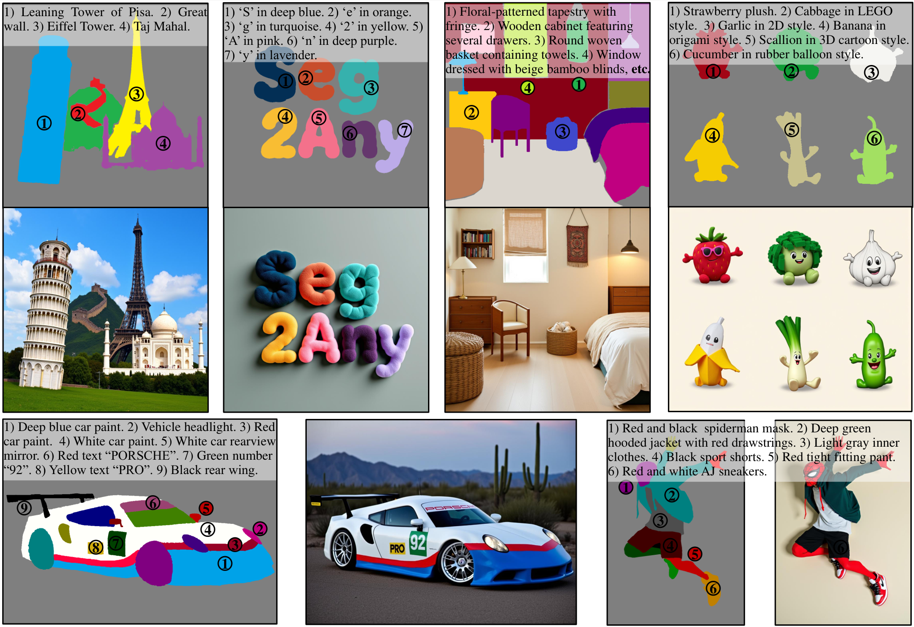
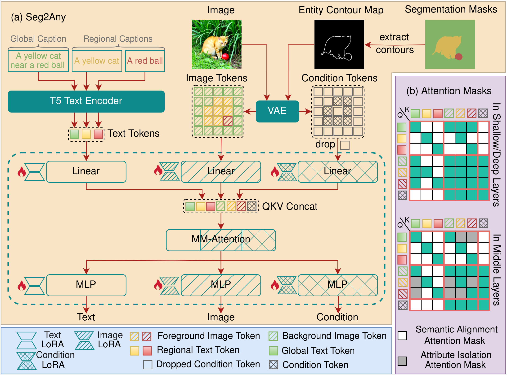

<h1 align="center">Seg2Any: Open-set Segmentation-Mask-to-Image Generation with Precise Shape and Semantic Control</h1> 

<div align='center'>
    <a href="https://github.com/0xLDF" target="_blank">Danfeng Li</a><sup>1*</sup>,</span>
    <a href="https://huizhang0812.github.io/" target="_blank">Hui Zhang</a><sup>1*</sup>,</span>
    <a href="https://www.linkedin.com/in/sheng-wang-4620863a/" target="_blank">Sheng Wang</a><sup>2</sup>,
    <a href="https://scholar.google.com/citations?user=qkaJhBMAAAAJ&hl=zh-CN" target="_blank">Jiacheng Li<a><sup>2</sup>,
    <a href="https://zxwu.azurewebsites.net/" target="_blank">Zuxuan Wu</a><sup>1†</sup>
</div>

<div align='center'>
    <br><sup>1</sup>Fudan University <sup>2</sup>HiThink Research
    <br><small><sup>*</sup>Equal Contribution. <sup>†</sup>Corresponding author. </small>
</div>
<br>

<div align="center">
  <!-- <a href='LICENSE'></a> -->
  <a href='https://seg2any.github.io'></a>
  <a href='https://arxiv.org/abs/2506.00596'></a>
  <a href="https://huggingface.co/0xLDF/Seg2Any"></a>
  <a href="https://huggingface.co/datasets/0xLDF/SACap-1M"></a>
  <a href="https://huggingface.co/datasets/0xLDF/SACap-eval"></a>

</div>
<br>

<p align="center">
  
</p>

## Overview

<p align="center">
  
</p>

(a) An overview of the Seg2Any framework. Seg2Any, which is built on the **FLUX.1-dev** foundation model, first converts segmentation masks into an Entity Contour Map and then encodes them into condition tokens via the frozen VAE. Negligible tokens are filtered out for efficiency. The resulting text, image, and condition tokens are concatenated into a unified sequence for MM-Attention. Our framework applies LoRA to all branches, achieving S2I generation with minimal extra parameters. (b) Attention Masks in MM-Attention, including Semantic Alignment Attention Mask and Attribute Isolation Attention Mask.

## News
- **2025-08-16**: ⭐️ The code of Seg2Any is released.

## Environment setup

```bash
conda create -n seg2any python=3.10
conda activate seg2any
pip install torch==2.6.0 torchvision==0.21.0 torchaudio==2.6.0 --index-url https://download.pytorch.org/whl/cu124
pip3 install -r requirements.txt

# The following packages are only required for model evaluation. You could skip them for training or inference deployment.
pip install qwen-vl-utils
pip install vllm==0.8.0 --index-url https://download.pytorch.org/whl/cu124

mim install mmengine
mim install "mmcv==2.1.0"
pip3 install "mmsegmentation>=1.0.0"
pip3 install mmdet
```
## Download weights

- Download [black-forest-labs/FLUX.1-dev](https://huggingface.co/black-forest-labs/FLUX.1-dev)
- Download [Seg2Any lora weights](https://huggingface.co/0xLDF/Seg2Any)
- Download [sam2.1_hiera_large.pt](https://huggingface.co/facebook/sam2.1-hiera-large/tree/main)

All the weights should be organized in models as follows:
```
Seg2Any/
├── train.py
├── requirements.txt
├── ...
├── ckpt
│   ├── sam2
│   │   └── sam2.1_hiera_large.pt
│   ├── ade20k
│   │   └── seg2any
│   │       └── checkpoint-20000
│   ├── coco_stuff
│   │   └── seg2any
│   │       └── checkpoint-20000
│   ├── sacap_1m
│   │   └── seg2any
│   │       └── checkpoint-20000
```

## Model inference

Run:
```
python infer.py \
--pretrained_model_name_or_path="black-forest-labs/FLUX.1-dev" \
--lora_ckpt_path="./ckpt/sacap_1m/seg2any/checkpoint-20000" \
--seg_mask_path="./examples"
```

## Model training

### Dataset preparation

Firstly, download the following datasets:


| Dataset             |  What to get                                                       |
| ------------------- |  ----------------------------------------------------------------- |
| [COCO-Stuff 164K](https://github.com/nightrome/cocostuff?tab=readme-ov-file#downloads) | `train2017.zip`, `val2017.zip`, `stuffthingmaps_trainval2017.zip`. |
| [ADE20K](https://ade20k.csail.mit.edu/index.html#Download)        | Full dataset (train + val).                                        |
| [SA1B](https://ai.meta.com/datasets/segment-anything-downloads/)           | raw images + segmentation mask annotations.                       |
| [SACap-1M](https://huggingface.co/datasets/0xLDF/SACap-1M)       | This dataset provides dense regional captions (average 14.1 words per mask) and global captions (average 58.6 words per image) for 1 million images sampled from SA-1B.                                          |
| [SACap-eval](https://huggingface.co/datasets/0xLDF/SACap-eval)      | 4,000 images for benchmarking (raw images, segmentation mask annotations, dense captions).                        |

The datasets have to be organized as follows:
```python
Seg2Any/
├── train.py
├── requirements.txt
├── ...
├── data
│   ├── ADEChallengeData2016
│   │   ├── annotations
│   │   │   ├── training
│   │   │   ├── validation
│   │   │   └── validation_size512 # generated  by eval/convert_labelsize_512.py
│   │   └── images
│   │       ├── training
│   │       └── validation
│   ├── coco_stuff
│   │   ├── stuffthingmaps_trainval2017
│   │   │   ├── train2017
│   │   │   ├── val2017
│   │   │   └── val2017_size512 # generated by eval/convert_coco_stuff164k.py and eval/convert_labelsize_512.py
│   │   ├── train2017
│   │   └── val2017
│   ├── SACap-1M
│   │   ├── annotations
│   │   │   ├── anno_train.parquet # from SACap-1M
│   │   │   ├── anno_test.parquet # from SACap-eval
│   │   ├── cache # where group_bucket.parquet file is stored. You could download from SACap-1M
│   │   ├── raw # from SA1B
│   │   │   ├── sa_000000
│   │   │   ├── sa_000001
│   │   │   └── ...
│   │   └── test # from SACap-eval
```

Seg2Any drops zero-value condition image tokens and inserts padding tokens for batch parallelism. To maximize training throughput and avoid wasting compute on padding tokens, we bucket samples by *condition image token* and *text token* counts.

Enable this in your dataset config `is_group_bucket: True`.

Run the below script **once** per dataset to pre-compute bucket map and cache them as `?H_?W-group_bucket.parquet`. Later dataset instantiations will reuse the cache automatically.

```bash
python prepare_dataset_bucket_map.py config/seg2any_ade20k.yaml \
  --data.train.params.is_group_bucket=True \
  --data.train.params.resolution=512 \
  --data.train.params.cond_scale_factor=1

python prepare_dataset_bucket_map.py config/seg2any_coco_stuff.yaml \
  --data.train.params.is_group_bucket=True \
  --data.train.params.resolution=512 \
  --data.train.params.cond_scale_factor=1

python prepare_dataset_bucket_map.py config/seg2any_sacap_1m.yaml \
  --data.train.params.is_group_bucket=True \
  --data.train.params.resolution=1024 \
  --data.train.params.cond_scale_factor=2
```

> Re-run the script if you change `cond_resolution (resolution // cond_scale_factor)`, because bucket map depends on the exact token count.

Pre-compute once bucket map times:

| Dataset    | Resolution | cond\_scale\_factor | Time               |
| ---------- | ---------- | ------------------- | ------------------ |
| ADE20K     | 512        | 1                   | $\approx$ 10 min |
| COCO-Stuff | 512        | 1                   | $\approx$ 10 min |
| SACap-1M   | 1024       | 2                   | $\approx$ 10 h   |

You can download the pre-built bucket map of SACap-1M from
[huggingface](https://huggingface.co/datasets/0xLDF/SACap-1M/tree/main/cache/train).

### Launch training
- Pick and edit the accelerate config that matches your compute resources. If you wish to use DeepSpeed, choose `config/deepspeed_stage2.yaml`; otherwise, use `config/accelerate_default_config.yaml`. 
- Set model configuration:
  - **attention_mask_method**:
    Determines which attention-mask pattern is injected into the MM-Attention blocks. choices: ["hard", "base", "place"].
      - "hard": the full scheme proposed in [Seg2Any](https://arxiv.org/abs/2506.00596). Semantic Alignment Attention (SAA) and Attribute Isolation Attention (AIA) are active.
      - "base": only Semantic Alignment Attention (SAA) is used.
      - "place": Uses the [PLACE](https://arxiv.org/abs/2403.01852) attention mask, re-implemented for MM-Attention.
  - **hard_attn_block_range**: 
      Specifies the range of blocks in which Attribute Isolation Attention (AIA) is applied. Valid only when attention_mask_method == "hard.
  - **is_use_cond_token**: If True, the Entity Contour Map is encoded as the condition token and concatenated with the text and image tokens into a unified sequence for MM-Attention.
  - **is_filter_cond_token**: 
      If True, zero-value condition-image tokens are dropped before the sequence is fed to MM-Attention, reducing computation.  
  - **cond_scale_factor**:
      Downsampling ratio of the condition image relative to the generated image.
Then run:
```
bash train.sh
```

## Model evaluation

- Download [Qwen/Qwen2-VL-72B-Instruct-AWQ](https://huggingface.co/Qwen/Qwen2-VL-72B-Instruct-AWQ).
- To evaluate the model on ADE20K and COCO-Stuff, you first need to convert ground-truth labels. Run the following commands only once.
  ```
  python eval/convert_coco_stuff164k.py --input_folder="./data/coco_stuff/stuffthingmaps_trainval2017/val2017" --output_folder="./data/coco_stuff/stuffthingmaps_trainval2017/val2017_temp"
  python eval/convert_labelsize_512.py --input_folder="./data/coco_stuff/stuffthingmaps_trainval2017/val2017_temp" --output_folder="./data/coco_stuff/stuffthingmaps_trainval2017/val2017_size512"
  python eval/convert_labelsize_512.py --input_folder="./data/ADEChallengeData2016/annotations/validation" --output_folder="./data/ADEChallengeData2016/annotations/validation_size512"
  ```
- Launch evaluation:
  ```
  bash eval.sh
  ```

## Citation
If you find Seg2Any useful for your research, welcome to 🌟 this repo and cite our work using the following BibTeX:
```bibtex
@article{li2025seg2any,
title={Seg2Any: Open-set Segmentation-Mask-to-Image Generation with Precise Shape and Semantic Control},
author={Li, Danfeng and Zhang, Hui and Wang, Sheng and Li, Jiacheng and Wu, Zuxuan},
journal={arXiv preprint arXiv:2506.00596},
year={2025}
}
```